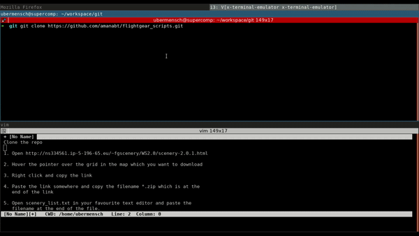

[](https://travis-ci.org/amanabt/flightgear_scripts)

# Flightgear Aircrafts and Scenery installer
Bash scripts for installing a list of Aircrafts and Sceneries

Installing FlightGear scripts can be challenging for beginners
as it requires you to download the map individually and extract
them in the required directories. Through these scripts I have
tried to automate this process of installing Aircrafts and Sceneries.

## Usage
### Aircrafts
- The scripts for installing the Aircrafts are located inside the
  [aircraft](aircraft) directory.
- The file [aircraft/aircraft_list.txt](aircraft/aircraft_list.txt) contains the
  list of aircraft that the scripts will download and install.
- You can get the entire list of aircrafts from this
  [link](http://mirrors.ibiblio.org/flightgear/ftp/Aircraft/)
- If you want to add an aircraft in the [aircraft/aircraft_list.txt](aircraft/aircraft_list.txt),
  just follow this [link](http://mirrors.ibiblio.org/flightgear/ftp/Aircraft/)
  and enter the exact name of the aircraft you want to download in the
  [aircraft/aircraft_list.txt](aircraft/aircraft_list.txt).
- **Exempli gratia:** Say we want to install the aircraft `Boeing 747`,
  then we go this [link](http://mirrors.ibiblio.org/flightgear/ftp/Aircraft/)
  and search for the aircraft. We find that there are several files corresponding
  to this aircraft, namely, `747.zip` `747-200.zip` `747-400.zip` `747-8i.zip`.
  You may choose one or all of the files depending on your preference and copy
  the file names (`747.zip` `747-200.zip` `747-400.zip` `747-8i.zip` or all)
  in [aircraft/aircraft_list.txt](aircraft/aircraft_list.txt). The aircraft will
  get installed after running the scripts. Note that the aircraft names should be
  separated by new line.
  
- Run
  ```bash
  cd aircraft
  ./install_aircrafts.sh
  ```
- Follow the steps and that should download and install the aircrafts.

### Scenery
- The scripts for installing the Flightgear Maps are located inside the
  [scenes](scenes) directory.
- The file [scenes/scenery_list.txt](scenes/scenery_list.txt) contains the
  list of sceneries that the scripts will download and install.
- The scenes are downloaded from this
  [link](http://ns334561.ip-5-196-65.eu/~fgscenery/WS2.0/)
- The FlightGear world scenery is divided into a grid of
  10&deg;latitude &times; 10&deg;longitude, which is nicely
  shown in this FlightGear GUI interface
  [scenery downloader](http://ns334561.ip-5-196-65.eu/~fgscenery/WS2.0/scenery-2.0.1.html)
- **Downloading FlightGear Scenery:**
  - Open http://ns334561.ip-5-196-65.eu/~fgscenery/WS2.0/scenery-2.0.1.html
  - Hover the pointer over the grid in the map which you want to download
  - Right click and copy the link
  - Paste the link somewhere and copy the filename *.zip which is at the
    end of the link
  - Open [scenery_list.txt](scenes/scenery_list.txt) in your favourite text
    editor and paste the filename at the end of the file.

<p align="center"> 
  
  <br>
  FlightGear Scenery installation instructions
</p>

- Run
  ```bash
  cd scenes
  ./install_scenary.sh
  ```

## Getting Parallel with GNU Parallel
Sometimes we might need to download and install a large number
of aircrafts and scenery data, which takes a lot of time to
download and unzip. These scripts can parallelise the process of
downloading data and extracting the files by using
[GNU Parallel](https://www.gnu.org/software/parallel/).
On running the script, it will check if GNU parallel is installed,
and if it is, it will use GNU Parallel, otherwise it will take
the serial approach.

### Installing GNU Parallel

```bash
wget http://mirror.rasanegar.com/gnu/parallel/parallel-latest.tar.bz2
tar jxf parallel-latest.tar.bz2 --one-top-level=parallel-latest --strip-components=1
cd parallel-latest
./configure && make
sudo make install
parallel --version #check if parallel has been installed
```

> **Warning:** The scripts fail (with GNU Parallal installed)
  if running behind a proxy server with a password which
  contains special characters, in that case avoid using
  GNU Parallel. Let me know if you have a solution.
